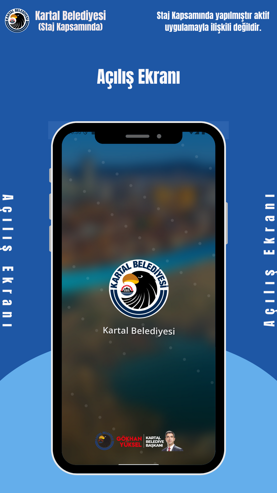
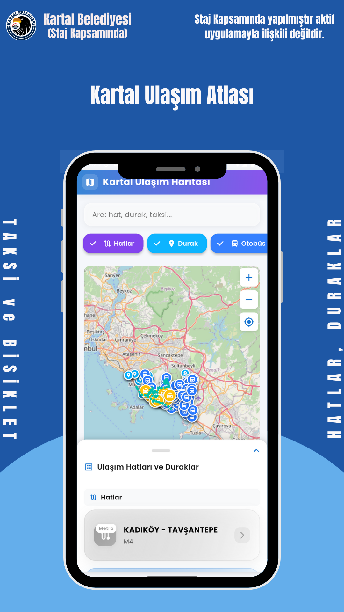
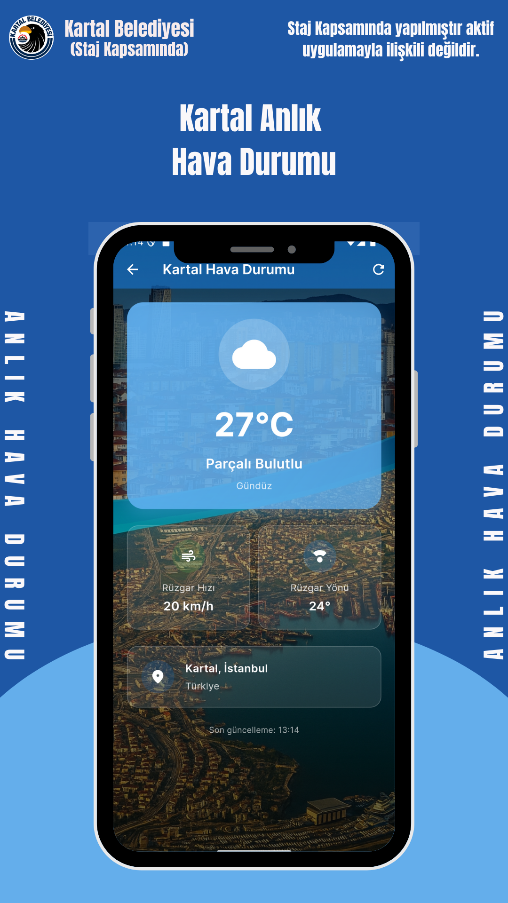
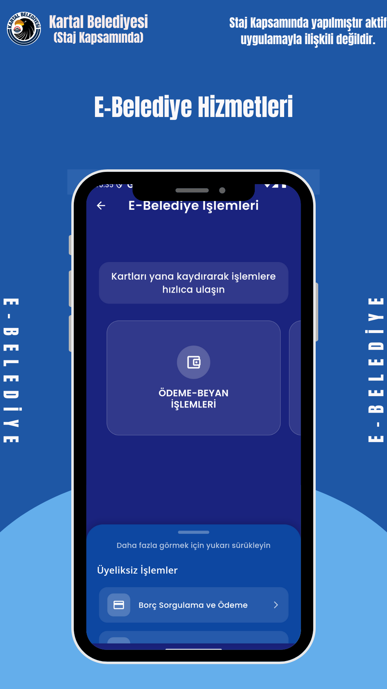
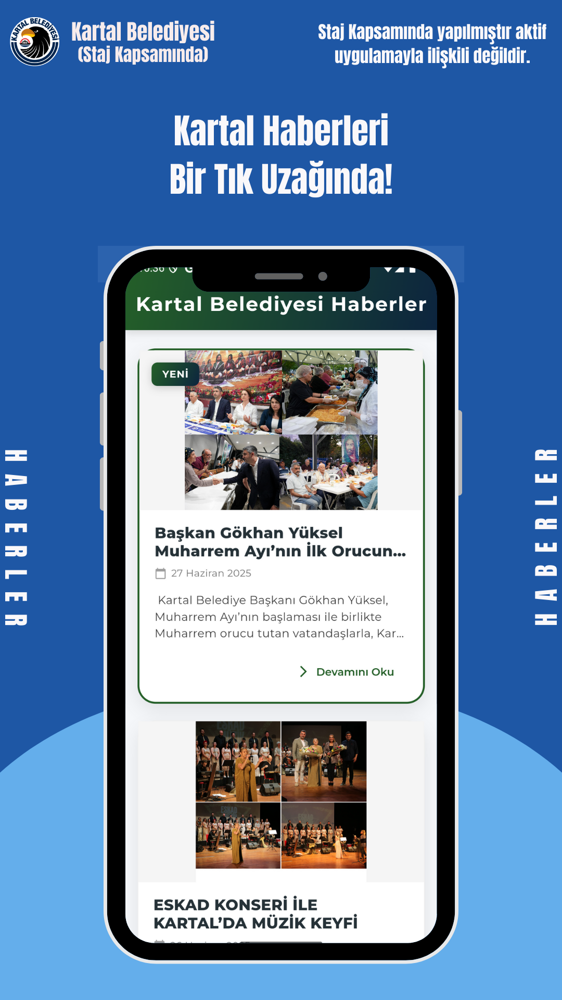
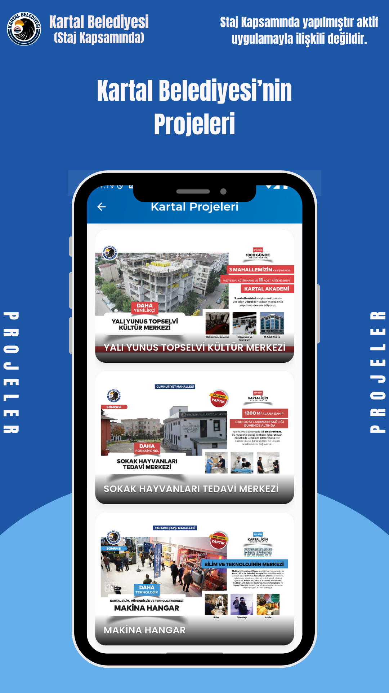
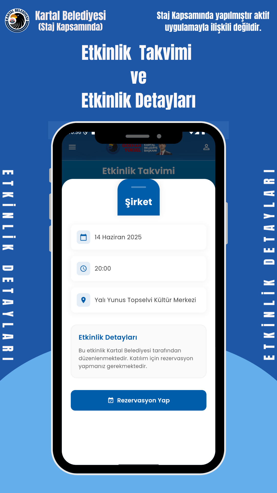
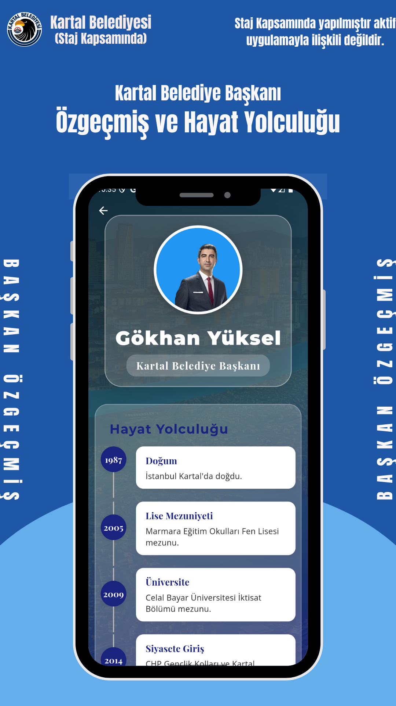
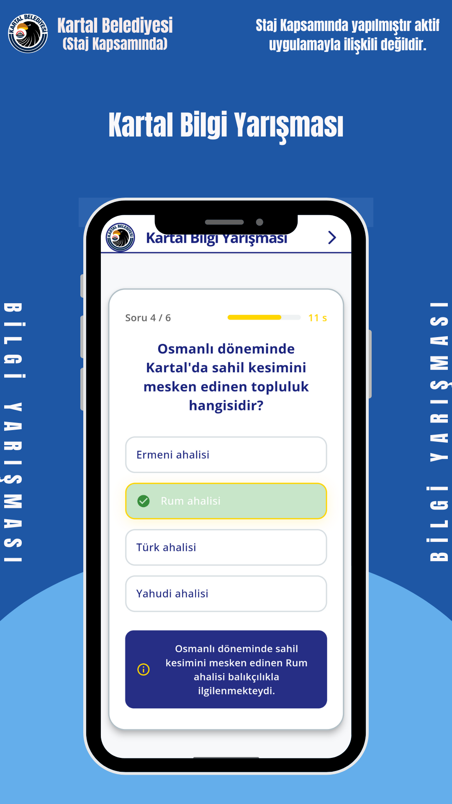

# 🏛️ Kartal Belediyesi Mobil Hizmetler Prototipi

> **⚠️ Yasal Uyarı / Disclaimer:** Bu proje, **Kartal Belediyesi Bilgi İşlem Müdürlüğü** bünyesindeki staj süresince Ar-Ge ve kavram kanıtı (Proof of Concept) amacıyla geliştirilmiştir. Kurumsal veri gizliliği ve güvenlik protokolleri nedeniyle **kaynak kodlar (source code) paylaşıma kapalıdır.** Bu repo, projenin teknik mimarisini ve UI/UX yetkinliklerini sergilemek amacıyla oluşturulmuştur.

## 📱 Proje Vizyonu
Kartal Belediyesi'nin "Dijital Belediyecilik" vizyonu doğrultusunda geliştirilen bu proje; vatandaşların belediye hizmetlerine, güncel haberlere ve kent bilgilerine tek bir mobil arayüzden **hızlı, kesintisiz ve kullanıcı dostu** bir şekilde erişmesini hedefler.

Uygulama, **Google Maps SDK** ile coğrafi bilgi sistemlerini, **RESTful API** ile anlık meteorolojik verileri ve **Dinamik İçerik Yönetimi** ile belediye duyurularını tek çatı altında toplar.

---

## 🛠️ Teknik Altyapı (Tech Stack)

| Alan | Teknoloji / Araç | Kullanım Amacı |
| :--- | :--- | :--- |
| **Language** | Java & Kotlin | Native Android Geliştirme |
| **Harita & LBS** | **Google Maps SDK** | Ulaşım hatları, duraklar ve konum servisleri |
| **Veri Akışı** | **RESTful API & JSON** | Hava durumu ve dinamik içeriklerin çekilmesi |
| **UI Components** | CardView, RecyclerView | Modern ve liste tabanlı arayüz tasarımı |
| **Architecture** | MVC / MVVM Pattern | Modüler ve temiz kod yapısı |

---

## 🗺️ Modül 1: Akıllı Şehir & Konum Servisleri
Vatandaşların kent içi ulaşımını ve günlük yaşamını kolaylaştıran teknik entegrasyonlar.

* **📍 Ulaşım Atlası:** Google Maps üzerinde otobüs durakları, taksi durakları ve hat güzergahlarının dinamik markerlar ile gösterimi.
* **☁️ Canlı Hava Durumu:** API entegrasyonu ile Kartal ilçesine özel anlık sıcaklık, rüzgar ve hava durumu verisi.

### 📸 Ekran Görüntüleri
| Ulaşım Haritası (Maps SDK) | Anlık Hava Durumu (API) | E-Belediye Hizmetleri |
| :---: | :---: | :---: |
|  |  |  |

---

## 📰 Modül 2: Kurumsal İletişim & Şeffaflık
Belediye ile vatandaş arasındaki iletişim köprüsünü güçlendiren bilgi modülleri.

* **📢 Haberler & Duyurular:** Belediyeden güncel haberlerin görsel kartlar (CardView) ile listelenmesi.
* **🏗️ Projeler Vitrini:** Kartal'a değer katan yatırımların detaylı tanıtım sayfaları.
* **📅 Etkinlik Takvimi:** Kültür-Sanat etkinliklerinin takibi ve rezervasyon arayüzü.
* **🏛️ Başkan & Yönetim:** Kurumsal biyografi ve vizyon sayfaları.

### 📸 Ekran Görüntüleri
| Ana Menü Dashboard | Haberler Akışı | Projeler & Yatırımlar |
| :---: | :---: | :---: |
|  |  |  |

| Etkinlik Takvimi | Başkan Özgeçmiş |
| :---: | :---: |
|  |  |

---

## 🧩 Modül 3: Etkileşim & Vatandaş Destek
Kullanıcı deneyimini artıran interaktif özellikler.

* **❓ Sıkça Sorulan Sorular (SSS):** Dinamik arama özelliği ile vatandaşların sorularına anında yanıt bulabildiği veritabanı.
* **🧠 Kartal Bilgi Yarışması:** Kent kültürünü tanıtmak amacıyla geliştirilmiş, oyunlaştırma (gamification) öğeleri içeren interaktif modül.

### 📸 Ekran Görüntüleri
| SSS ve Arama | Bilgi Yarışması (Quiz)
| :---: | :---: | :---: |
|  | 

---

## 👨‍💻 Geliştirici Notu
Bu proje, staj süresince **gerçek dünya senaryoları** üzerine çalışarak; API tüketimi, harita işlemleri ve kurumsal mobil uygulama mimarisi konularında yetkinlik kazanmamı sağlamıştır.

* **Geliştirici:** Berkay Ay
* **LinkedIn:** linkedin.com/in/berkayay
* **Email:** berkay81341@gmail.com

---
*© Bu projenin görsel ve fikir hakları geliştiriciye ve ilgili kuruma aittir.*
